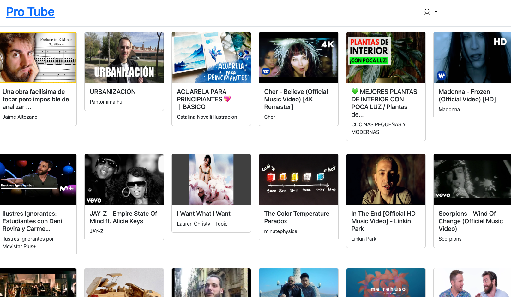
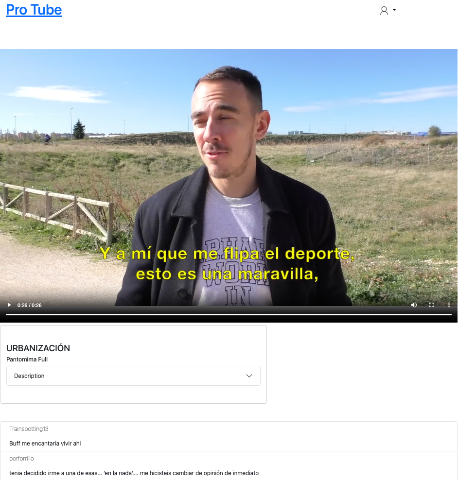
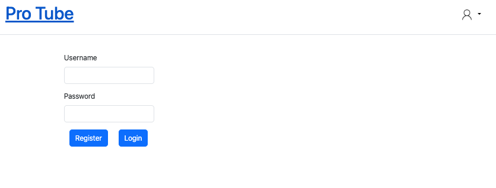
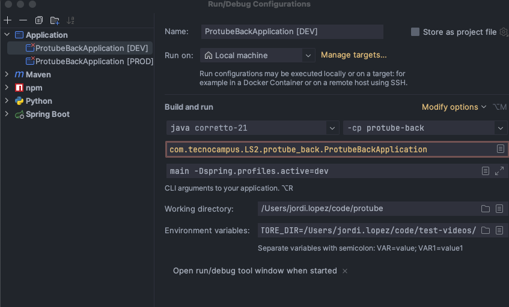
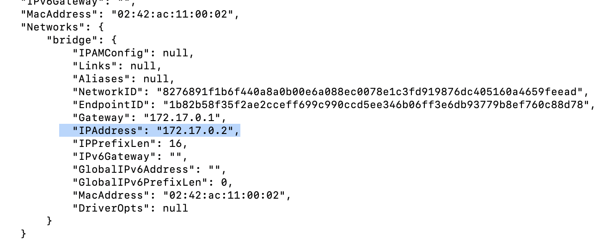

# Pro tube project

## Project
The project consists of building a web application where the user can watch and comment videos uploaded by other registered users.

### Goals

The goal of this exercise is to reproduce as much as we can a REAL work environment.
Creating a defined project from scratch using Agile methodologies to develop it.

### Teams

You have to create a groups of 3-4 people to develop the project. It depends on the team, but the main idea is to have
at least one people in charge of the definition of the features.

### Evaluation

The evaluation of the subject depended on 2 parts:

* **50%** Practical (Delivery of the project)
* **50%** Exam (Will be an exam asking about your delivery, how you implemented something, asking for a new feature –how do
  you structure–, etc.)

Even the project is done in team the evaluation will be individual and will follow a continuous evaluation.

⚠️ The minimum qualification in the two parts to approve the subject will be 3. In case Exam is not pass with more than 3
the student has right to a Recovery exam.

### Code contribution

* All the contribution will be done by Pull Request leaving main branch locked of commit directly.
* The pull request have to be reviewed for some other members of the team and approved at least by one people.
* Commits should be a definition of the changes done. And should contain a reference of the task. P.e
  using [convention commits](https://www.conventionalcommits.org/en/v1.0.0/#summary)

### Agile

Every team will decide which agile framework will use. The most important here is to follow Agile methodologies. The
team will decide which ceremonies will do (Daily, Refinement/grooming, retrospective, demo, etc.).

#### Agile ceremonies

| Name                | Description                                                                                                                                                                                                                                                   | Duration                                   | Frequency                          | Outcome                                                                                                                      |
|---------------------|---------------------------------------------------------------------------------------------------------------------------------------------------------------------------------------------------------------------------------------------------------------|--------------------------------------------|------------------------------------|------------------------------------------------------------------------------------------------------------------------------|
| Daily               | Report of the current status of the sprint                                                                                                                                                                                                                    | 10min                                      | Every day                          | In this ceremony the team have to talk about the work, detect some possible blockers and check the status of the sprint goal |
| Retrospective       | Meeting to look back of the previous sprint and detect strengths and weakness                                                                                                                                                                                 | 1h                                         | At the end of the Sprint           | The outcome of the retrospective is to create Actions point to be tackled in the following sprints                           |
| Refinement/Grooming | In this meeting the them have to talk about future coming stories, detect potential issues or dependencies and do an estimation of every task                                                                                                                 | 1h                                         | Once a week/sprint                 | Task with all the requirements discussed for every task and also an estimation of effort of the task                         |
| Demo/Sprint review  | This meeting is for the stakeholders of the project and the team has to show the new features introduced in the sprint                                                                                                                                        | 30min max                                  | At the end of the sprint           | Retrieve feedback from stakeholders                                                                                          |
| Post mortem         | On demand meeting that consist on analyze Critical issues that happened in the past.                                                                                                                                                                          | Depending on the # of task to be discussed | On demand at the end of the sprint | The outcome is to create Action Points to prevent that the analyzed issue in the future                                      |
| Planning            | This is the closing sprint ceremony. All the non-finished tasks will be moved to the following sprint. Also the team decide the effort capacity that will have for the next sprint and according the capacity will decide the task tackled in the next sprint | 30min                                      | On demand at the end of the sprint | The work to do in the next sprint                                                                                            |

### MVP

The MVP consist in create a basic web with the following features:

* EVALUATION 5
* Authentication (Basic Register/login, etc.)
* View list of videos (using videos generated by videoGrabber tool)
* Play a video
* Everything has to be well tested

* EVALUATION 7.5
* Video Upload (Title + video)
* Comments has to be shown in every video
* Registered users can add a comment

Home page example



Video player example




Authentication example



### Improvements

Every team have to decide how the application has to be improved. With the MVP the evaluation could be achieved as 5,
depending on the improvement every team decide this evaluation will raise up to 10.
We list a set of potential improvement BUT every team can decided others by themselves.

* Authentication with OAuth or other similar system
* Rating videos
* Mobile/Responsiveness
* Searcher
    * Using current DB
    * Using cached system such as Rabbit, Elastic
* Video metadata editor (tags, description, category, etc.)
* Documentation (Swagger, JSDocs etc.)
* Deployed (In any case you can use extracted videos from Youtube™ due to copyright)

## Tech requirement

Before starting coding you have to be sure you have the following software already installed:

### Backend

* Java 21

### Frontend

* Node 20

### Database

* Docker or Postgres installed in the machine.

### Video grabber

* yt-dlp 
  * On Linux / Windows with WSL
    * ```commandline
      sudo wget https://github.com/yt-dlp/yt-dlp/releases/latest/download/yt-dlp -O /usr/local/bin/yt-dlp
      // And after:
      sudo chmod a+rx /usr/local/bin/yt-dlp
      ```
    * On mac
      ```commandline
      brew install yt-dlp
      ```
* ffmpeg
    * On Windows: Download the ffmpeg executable from FFmpeg’s official website. Extract the files and add the bin
      directory to your system’s PATH.
    * On macOS: Use Homebrew to install ffmpeg:
      ```commandline
      brew install ffmpeg
      ```
    * On Linux:  On Linux / Windows with WSL Install ffmpeg using your package manager. For example, on Ubuntu:
      ```commandline
        sudo apt-get update
        sudo apt-get install ffmpeg
      ```
      
Remember to remove this packages in case you don't want after the project you can execute the following command
```commandline
sudo apt-get remove package // (yt-dlp or ffmpeg)
```
* Python 3x

## Backend

To run the backend, if you open the workspace you have to set the following configuration:

In Intellij IDEA create a new run configuration with the following settings



For Environment variables (if you don't see select it from Modify Options menu)

```
ENV_PROTUBE_DB={database-name};ENV_PROTUBE_DB_PWD={database-password};ENV_PROTUBE_DB_USER={database-user};ENV_PROTUBE_STORE_DIR={stored-folder-path}
```

⚠️ NOTE: Database must be active before running backend.

⚠️ NOTE: If you want to see some video examples run the `tooling/videoGrabber` script and set the path of the videos to
the ENV variable `ENV_PROTUBE_STORE_DIR`.

## Frontend

Navigate in a terminal to `frontend` folder and run the following command to install dependencies

```commandline
npm install
```
Once dependencies are installed properly run the following code to execute the application in `dev` mode

```commandline
npm run dev
```

This command above will open a port 5173 where you can access from the browser.

For run the tests

```commandline
npm run test
```

## Tooling

### Video grabber

#### Installation
First step is to have configured a WSL in your Windows Machine. In case you use unix-like system (linux or mac) you can follow sim

This script here help you to generate a default content for the web.

Once you have resolved the dependencies explained above you can run the following command inside `tooling/videoGrabber`
folder.

```commandline
python3 main.py --store={Store_Folder} --id=10 --recreate --videos={Path to video_list.txt}
```

Explanation of the parameters:

| Attribute | Type                           | Description                                                                                                     | Example                                                       |
|-----------|--------------------------------|-----------------------------------------------------------------------------------------------------------------|---------------------------------------------------------------|
| id        | integer                        | Number to seed random                                                                                           | `--id=2`                                                      |
| store     | string (path to local machine) | Folder where videos download will be downloaded                                                                 | `--store=/usr/user/home/videos`                               |
| recreate  | boolean                        | Do overwrite of the store folder                                                                                | `--recreate` or `--recreate=False`                            |
| videos    | string (path to local machine  | Path where videos list is saved. there is a default videos inside `resources` folder. But it can be overwritten | `--videos=/src/user/home/LS-protube/resources/video_list.txt` |

The command will generate 3 files per every video disposed in `resources/video_list.txt`

* *.mp4: The video cutted
* *.webp: The thumbnail
* *.json: Metadata info about the video

## Set database

### Instruction using Docker

* Download docker image
  ```commandline
  docker pull postgres
  ```
* Create container
  ```commandline
  docker run --name postgres-dev -p 5432:5432/tcp -h 127.0.0.1 -e POSTGRES_USER=root -e POSTGRES_PASSWORD=secret -e PGDATA=/var/lib/postgresql/data/pgdata -e POSTGRES_INITDB_ARGS--auth-host=scram-sha-256 -v /Users/jordi.lopez/docker-postgres:/var/lib/postgresql/data -d postgres:latest
  ```
* Once you have created you can start it using
  ```commandline
  docker start postgres-dev
  ```
* Now let's install an Admin page
  ```commandline
  docker pull dpage/pgadmin4
  ```
* Set container for Postgres Admin
  ```commandline
  docker run -e PGADMIN_DEFAULT_EMAIL={YOUREMAIL} -e PGADMIN_DEFAULT_PASSWORD=test1234 -e PGADMIN_CONFIG_WTF_CSRF_ENABLED=False -p 8888:80 --name pgadmin4-dev dpage/pgadmin4
  ```
* Once you have created you can start it using
  ```commandline
  docker start dpage/pgadmin4
  ```
* Retrieve the Internal Ip
  ```commandline
  docker inspect pgadmin4-dev
  ```
  
